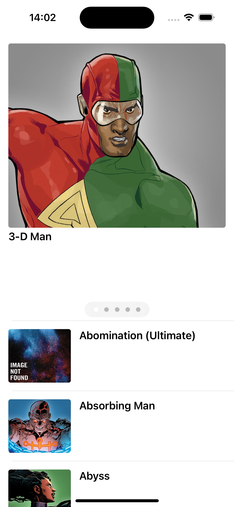

## Sobre

Esse App se utiliza da API da Marvel para listar os personagens em ordem alfabética.
Algumas Feature:
- Pull to refresh
- Scroll infinito

## Imagens

## Pré requisitos:
- XCode 14.2(Essa é a versão que eu usei, mas pode funcionar com uma mais antiga)
- Swift 5
- Cocoapods 1.12.0

## Setup
Eu comitei a pasta Pods para facilitar o setup, então não deve ser necessário rodar um `pod install`

As chaves da API da Marvel não foram comitadas pois isso seria uma falha de segurança. Eu enviei os arquivos de chaves por e-mail para serem repassados aos avaliadores. Esses arquivos devem ser colocados no caminho `desafio-mobile-iOS/MarvelCharacters/` (Mesma pasta do AppDelegate)

## Arquitetura
Utilizei a arquitetura VIP para melhor separação das responsabilidades entre classes e facilitar os testes unitários através de injeção de dependências.

## Dependências
Normalmente não uso dependências nesse tipo de teste, mas como era um pré-requisito me senti a vontade para economizar algum tempo incluindo algumas bem conhecidas.
 - Alamofire: Para facilitar as chamadas de API.(Hoje só existe um endpoint implementado no app, porém, como o plano é adicionar mais no futuro, ter uma abstração para chamadas bem completa como o Alamofire pode facilitar bastante.)
 - AlamofireImage: Para facilitar o download de imagens.
 - Nimble: Para conseguir testar código assíncrono eu acabaria tendo que colocar completion blocks em muitas funções, o Nimble torna esse tipo de teste muito fácil através do `toEventually()`. Ele também foi muito útil para testar um `fatalError()` na classe `BaseViewCodeController`.
 - OHHTTPStubs: Permite mockar chamadas de API de forma fácil sem ser necessário criar um mock de URLSession gigantesco para injetar na sua classe de Network.
 
 
## Considerações
- Eu estava mais acostumado com a arquitetura VIPER, porém gostei bastante da VIP, acredito que a injeção de dependências fica um pouco mais simples por seguir um sentido único.
- Não criei muitos testes unitários para a camada de UI, pois precisaria de muito tempo para tornar cada componente injetável ou então precisaria deixar tudo como público. Idealmente essa parte seria testada com UITests ou testes de Snapshot, o que atrasaria um pouco a entrega.
- Eu tornei o `CharacterListDataSource` extremamente complexo para cobrir o cenário onde o carrossel de imagens do topo é carregado parcialmente para caso o limite de items passado para a API fosse menor do que 5. Eu sei que poderia ter ignorado esse cenário forçando a quantidade de items a sempre ser maior do que 5 mas pensei que seria um desafio interessante tornar o código o mais resiliente possível. (Todos os branches estão cobertos por testes unitários)
- Antes eu estava recarregando a tableView toda ao pegar novos items da API, porém isso gera alguns problemas de performance, então gastei um tempão melhorando a função `updateDataSource` da `CharacterListViewController` para executar as operações de inserção e remoção precisamente nos indíces alterados.
- Acabei dando uma corrida pra conseguir colocar uma persistência básica no UserDefaults, com isso tornei a listagem um pouco mais configurável.

 
## Planos futuros
- Colocar o Lottie pra ter uma animação de loading diferente na LoadingTableViewCell ao invés do spinner padrão.
- Tela de detalhe ao clicar em algum personagem mostrando mais informações. 
- Tornar a listagem ainda mais configurável, permitindo busca e customizar a quantidade de itens no carrossel.

