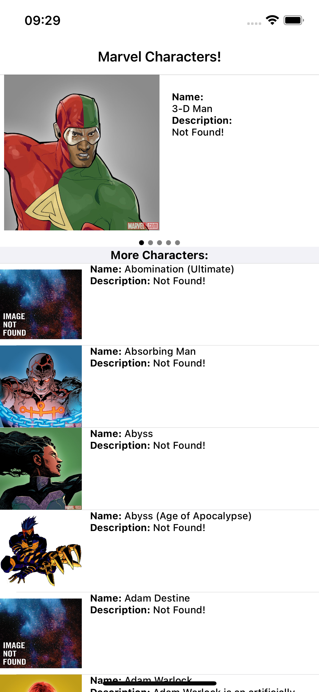
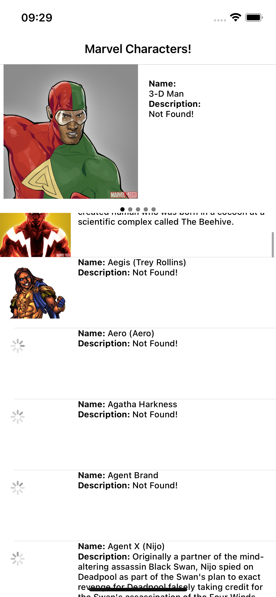
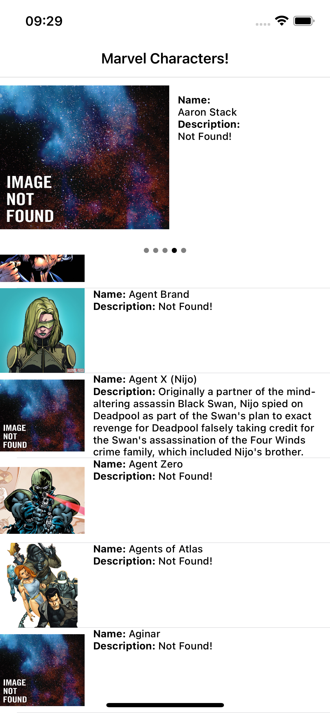

# Sobre:
- Desafio: 
  - Este App foi criado como um desafio de exibir os personagens da Marvel em um app iOS
- O que foi desenvolvido: 
  - A tela inicial contém um carrousel no topo com os 5 primeiros personagens
  - Logo abaixo do carrousel existe uma lista infinita que busca de 10 em 10 os registros da API conforme o scroll
  - O Carrousel tem um indicador da página atual
  - Imagens mostram um load indicator enquanto não carregam a imagem da URL
  
# Telas:

# Requisitos do projeto:

- Swift 5
- Xcode
  - 13.4
- Arquitetura
   - MVVM
   - Coordinator
- Cocoapods
   - AlamoFire
- Testes unitários
   - Teste básico de UI utilizando objeto mockado
- GitFlow
   - Utilizado a branch develop para desenvolver toda a feature
   - Gerado a branch release para testar e corrigir possíveis bugs
   - Merge da release para main no final do desenvolvimento 

#Instruções para rodar o projeto:

- Rodar pod install na raiz do projeto
- Abrir projeto no Xcode

# RoadMap

- Criar opção de busca para poder filtrar os personagens
- Criar opção de ordenação (como a api oferece: nome e data de modificação)
- Criar tela de detalhes para listar mais informações dos personagens
