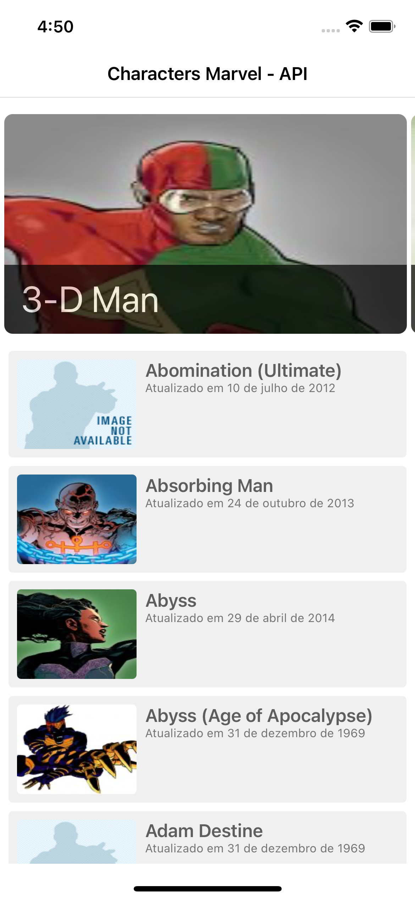
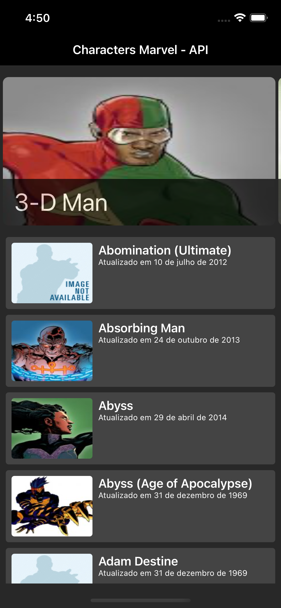

## :scroll: Sobre
### 
App que utiliza a <a href="https://www.marvel.com/characters">API Marvel</a> para listar os personagens do seu universo. 

 O aplicativo lista os personagens do univérso da Marvel, exibindo o <b>nome</b> e da <b>data</b> da última vez que aquela informação foi atualizada.

 Para o desenvolvimento desse aplicativo foram utilizada as seguintes tecnologias:

* CocoaPods
* Lottie
* LottieFiles do @Elan Chez

## :camera_flash: Screenshots

&emsp;

## Gostaria de melhorar
* Adicionar uma tela de detalhando as informações de cada personagem. 
* Implementar testes de `UI` e `Snapshot`. 
* Adicionar um cache para as imagens e os dados da lista usando o `CoreData`.
* Adicionar a possibilidade de busca por personagens utilizando o `UISearchController`